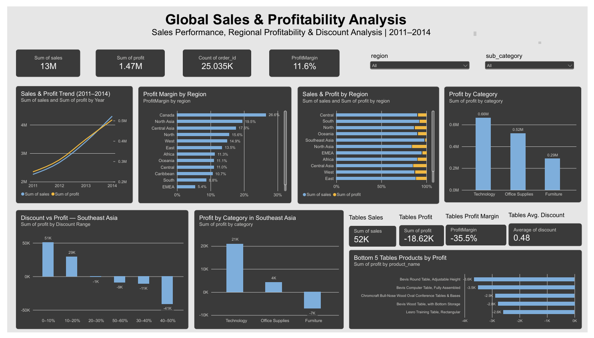

# Global Sales & Profitability Analysis

## 📌 Project Overview

This project analyzes global sales performance and profitability from 2011 to 2014.

The analysis focuses on identifying sales and profit trends, regional profitability, category performance, and the relationship between discount levels and profit.

A deeper analysis was conducted for the Southeast Asia region, with a focus on the Tables sub-category.

## 🎯 Business Problem

The business needs to understand how sales performance and profitability changed over time and across different regions and product categories.

This analysis aims to answer the following questions:

1. How did sales and profit change from 2011 to 2014?
2. Which regions generated the highest and lowest profit margins?
3. Which product categories contributed the most to total profit?
4. How does discount level relate to profitability?
5. Why does the Tables sub-category perform poorly in Southeast Asia?
6. Which Tables products generated the largest losses in Southeast Asia?

## 📊 Dataset

The dataset contains transactional sales data covering the period 2011–2014.

The analysis uses several key fields, including:

- `order_id` — unique identifier for each order
- `product_id` — identifier for each product
- `product_name` — name of the product
- `category` — product category
- `sub_category` — product sub-category
- `region` — sales region
- `sales` — sales revenue
- `profit` — profit generated
- `quantity` — quantity sold
- `discount` — discount applied
- `shipping_cost` — shipping cost
- `year` — transaction year

## 🛠️ Tools

- **Microsoft Excel** — data exploration, validation, pivot tables, and initial analysis
- **Microsoft Power BI** — data visualization and interactive dashboard

## 🔍 Analysis & Key Findings

### 1. Sales & Profit Trend

Sales and profit showed a consistent upward trend from 2011 to 2014.

- Sales increased from approximately **2.26M in 2011** to **4.30M in 2014**.
- Profit increased from approximately **249K in 2011** to **504K in 2014**.
- Profit margin remained relatively stable, increasing from **11% to 12%**.

**Insight:** The business experienced strong growth in both sales and profit throughout the period, while maintaining a relatively stable profit margin.

---

### 2. Regional Profitability

Profitability varied considerably across regions.

- **Canada** recorded the highest profit margin at approximately **26.8%**.
- **North Asia** and **Central Asia** also showed strong profit margins at approximately **19.5%** and **17.6%**.
- **EMEA** recorded the lowest profit margin at approximately **5.4%**.

**Insight:** High sales volume does not necessarily result in the highest profitability. Regional differences in discount levels, product mix, and operating costs may contribute to differences in profit margin.

---

### 3. Category Performance

Among the three main product categories:

- **Technology** generated the highest total profit at approximately **0.68M**.
- **Office Supplies** generated approximately **0.52M**.
- **Furniture** generated approximately **0.29M**.

**Insight:** Technology was the strongest category in terms of total profit, while Furniture contributed the least.

---

### 4. Discount vs Profit

The analysis shows a negative relationship between higher discount levels and profitability, particularly in Southeast Asia.

In Southeast Asia:

- **0–10% discount** generated approximately **50.8K profit**.
- **10–20% discount** generated approximately **29.4K profit**.
- Higher discount ranges resulted in increasingly negative profit.
- The **40–50% discount range** generated approximately **-41.2K profit**.

**Insight:** Higher discounts are associated with lower profitability. Excessive discounting can turn otherwise profitable sales into losses.

---

### 5. Southeast Asia — Category Performance

Southeast Asia generated approximately **884K in sales** and **17.9K in profit**, resulting in a relatively low overall profit margin of approximately **2%**.

Category performance varied significantly:

- **Technology:** approximately **21K profit**
- **Office Supplies:** approximately **4K profit**
- **Furniture:** approximately **-7K profit**

**Insight:** Furniture was the weakest category in Southeast Asia and generated an overall loss.

---

### 6. Southeast Asia — Tables

The Tables sub-category showed particularly weak performance in Southeast Asia.

- Total sales: approximately **52K**
- Total profit: approximately **-18.6K**
- Profit margin: approximately **-35.5%**
- Average discount: approximately **48%**

Several Tables products generated significant losses, indicating that the combination of high discounts and product-level performance contributed to the sub-category's poor profitability.

**Insight:** Tables should be prioritized for further evaluation, especially products with consistently negative profit and high discount levels.

## 💡 Recommendations

Based on the analysis, the following actions are recommended:

### 1. Review High-Discount Strategies

The business should review discount policies, particularly discount levels above 20%.

Higher discount ranges were associated with significantly lower profitability in Southeast Asia, with the 40–50% discount range generating approximately **-41.2K profit**.

Instead of applying high discounts broadly, discounts should be targeted toward products or customer segments where they can generate sufficient additional sales volume.

### 2. Evaluate the Tables Sub-category in Southeast Asia

The Tables sub-category should be prioritized for further evaluation due to its negative profitability.

With approximately **52K in sales** and **-18.6K in profit**, the sub-category generated a **-35.5% profit margin** with an average discount of approximately **48%**.

The business should review pricing, discount policies, shipping costs, and product-level profitability before continuing aggressive promotions.

### 3. Review Loss-Making Products

Products with consistently negative profit should be investigated individually.

The business can evaluate whether these products have:

- Excessive discounts
- High shipping costs
- Low selling prices
- Low demand
- High operational costs

Products that remain unprofitable after review may need pricing adjustments, reduced promotions, or discontinuation.

### 4. Maintain Focus on High-Performing Categories

Technology generated the highest total profit among the three major categories.

The business should continue supporting high-performing categories while identifying the factors behind their stronger profitability, such as pricing, product mix, and discount strategy.

### 5. Monitor Regional Profitability

Regional performance should be monitored using both **sales volume and profit margin**, rather than sales alone.

Regions with high sales but relatively low profit margins should be reviewed to identify opportunities to improve pricing, discounting, and operating efficiency.

## 📊 Dashboard

The interactive dashboard was created using Microsoft Power BI to provide an overview of sales performance, profitability, regional performance, category performance, discount levels, and product-level profitability.

## 📌 Conclusion

The analysis shows that the business experienced strong growth in sales and profit between 2011 and 2014. However, profitability varied considerably across regions, categories, and discount levels.

The analysis also identified Southeast Asia, particularly the Tables sub-category, as an area requiring attention due to its negative profit margin and high average discount.

Overall, the findings suggest that improving discount strategies, reviewing loss-making products, and monitoring profitability at the regional and product levels could help improve business performance.

## 🧠 Skills Demonstrated

- Data cleaning and validation
- Exploratory data analysis
- Excel Pivot Tables
- KPI analysis
- Profitability analysis
- Regional and category analysis
- Discount analysis
- Data visualization
- Dashboard development with Power BI
- Business insight and recommendation
